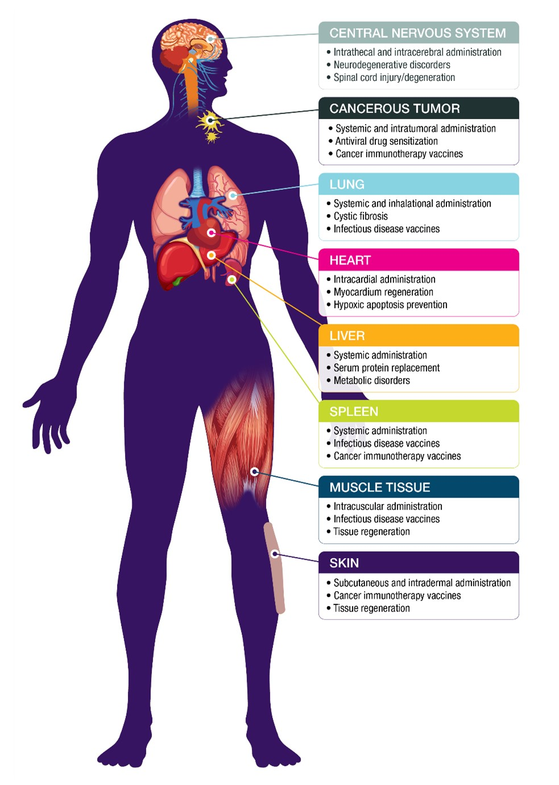
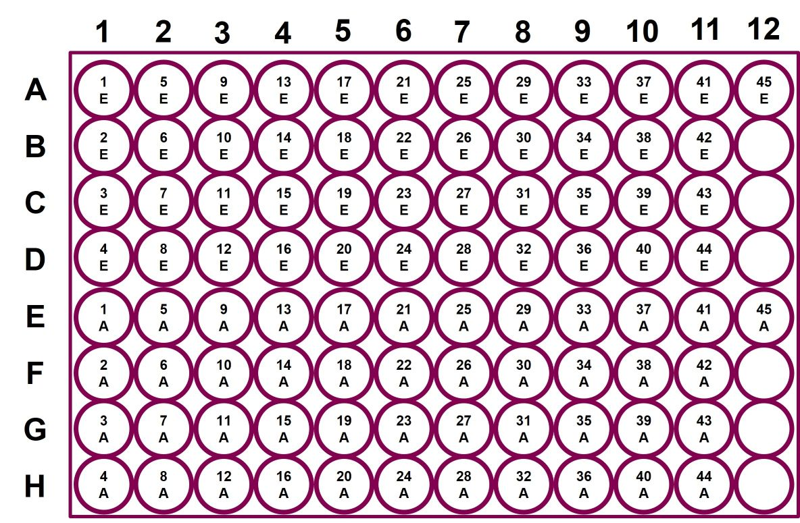
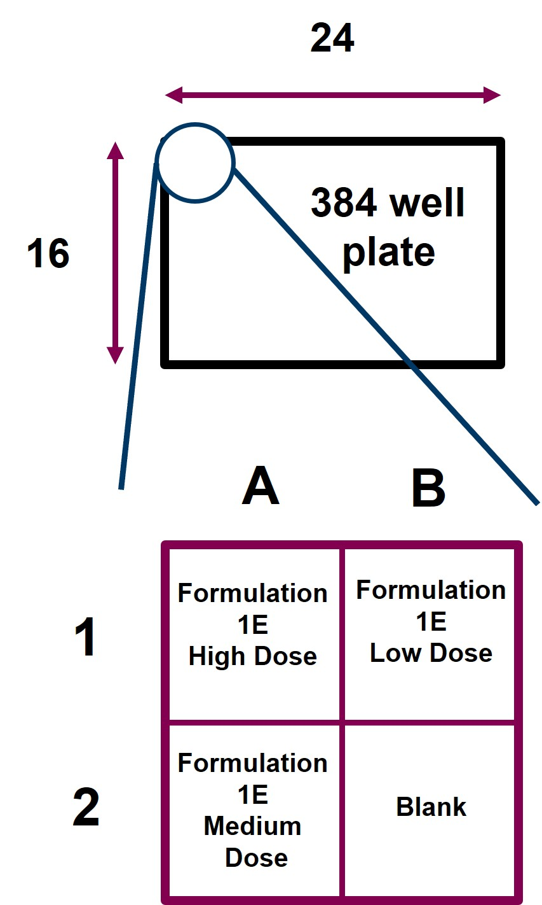

```{r setup, include=FALSE}
knitr::opts_chunk$set(echo = TRUE)
```

# 1. Introduction

Among the variety of emerging medicines, nucleic acids are a novel therapeutic modality with significant potential.  Nucleic acid therapies are in development for a wide variety of maladies including cancer, protein replacement, and infectious disease (<b>Figure 1-1</b>).<sup>1</sup>  Most recently, two mRNA vaccines were approved by the FDA and administered to the broader population as a part of the response to the COVID-19 pandemic in 2020.<sup>2</sup>  Despite the promise of this new class of medicines, several key challenges remain to full realization of its potential.  Compared to other drug subtypes, naked nucleic acid (especially mRNA) is very fragile and degrades in a matter of minutes upon administration.  Additionally, nucleic acids cannot cross freely into cells to reach the intracellular machinery required to leverage its therapeutic effect.<sup>3</sup>

{width=50% height=50%}

<b><u>Figure 1-1</b></u>: Summary of various tissue targets and therapeutic applications of nucleic acid therapeutics.  Adopted from Reference 1.

Collectively, these challenges are addressed through the formulation of nucleic acid with other biologically active molecules to circumvent these barriers.  Most commonly, the nucleic acid is combined with water insoluble molecules known as lipids to form a lipid nanoparticle (LNP).<sup>4</sup> The fabrication process for nucleic acid LNPs is highly intricate and requires precise control over relevant parameters.  Specifically of interest is the relative proportion of the lipid components in the LNP as this has been shown to dramatically impact LNP pharmacokinetics and pharmacodynamics across several preclinical studies.<sup>5</sup>  Additionally, other process parameters such when the nucleic acid is mixed with the lipid and how much nucleic acid is mixed with lipid are of particular interest and should be optimized depending on the therapeutic application.

In this project, data that were collected as part of a formulation optimization study for a novel polymer/lipid hybrid delivery system will be analyzed.  The experiment was conducted over the course of a month in July 2021 on site at AstraZeneca in Gaithersburg, MD and consisted of 45 independent formulation ratios of lipid components to span the design space.  The formulations were evaluated for the biophysical parameters of size and nucleic acid incorporation efficiency. These formulations were tested for in vitro delivery of two nucleic acid types: mRNA and DNA.  Owing to the tissue specificity imparted on LNP therapeutics derived from the relative ratios of formulation components, these samples were tested on a variety of cell types including muscle, liver, lung, and immune.  Two mRNA incorporation strategies were utilized to localize the nucleic acid cargo in the center or the surface of the particle.  Additionally, 3 nucleic acid/lipid ratios were tested on each cell type.  Cells of each tissue type of interest were incubated with LNPs carrying nucleic acids encoding fluorescent protein.  The fluorescent signal from this protein was tracked with live cell imaging every 6 hours for 72 hours.  Using this experiment data a series of research questions will be answered pertaining to the independent variable impact on transfection response.  Additionally, the relationship between the dependent variables will be evaluated.  Continued analysis of formulation process parameters will allow for more targeted and effective nucleic acid therapeutics.

### Research Questions:
There are 4 research questions that this analysis will address:<br>

<b>1. Is there an optimal time point and dosing for sampling that would capture the relative difference in the treatment?</b><br>

Determination of an optimal time point and dosing could be useful in reducing the amount of data that needs to be collected for each transfection, thus minimizing long term use of computer storage space for large image files collected from each scan.  The optimal time point and dose will be determined primarily with exploratory data analysis and multivariate linear regression modeling.

<b>2. How do the individual variables of cell type, nucleic acid type, and incorporation method impact the transfection reading?</b><br>

The binary categorical variables of nucleic acid incorporation strategy (encapsulation or adsorption) and type (DNA and mRNA) will be evaluated in the context of cell type to determine the optimal combination.  This will be accomplished with ANOVA test of the transfection response with respect to these explanatory variables. 

<b>3. How do individual formulation components impact the response in transfection?</b><br>

Relative percentages of the lipids in the nucleic acid formulation can have significant impact on performance, especially with respect to cell type.  The impact of each of these formulation components will be assessed with Scheffe polynomial modeling of the transfection response with respect to the formulation components.

<b>4. Can size/incorporation efficiency predict transfection performance?</b></br>

It would be useful and resource saving if the transfection performance could be predicted by the biophysical properties of the formulation collected upstream of a transfection experiment.  To determine if this is possible, a multivariate linear regression model will be constructed for average formulation transfection response with respect to measured size and nucleic acid incorporation efficiency.

# 2. Data Description

### Description of Initial Data Files

The data for this analysis comes from a series of <i>in vitro</i> experiments aimed at characterizing the biophysical properties and transfection efficacy of 45 unique formulations for mRNA and DNA delivery.  The formulations consist of 5 components (DOTAP, MC3, DMG-PEG, DSPC, and cholesterol) and a formulation ID was assigned to each unique combination of these components.  The formulation levels were computed as a D-Optimal design in the statistical software JMP.<sup>6</sup>  The molar percentage of each component is given along with the corresponding formulation ID in the file Formulation_Components.csv. 

The formulations were prepared in a 96 well plate format by a Hamilton vantage and is given in <b>Figure 2-1</b>.

{width=50% height=50%}

<b><u>Figure 2-1</b></u>: The 96 well layout for synthesis of the formulations. The raw data for size and incorporation efficiency refers to the well, not the formulation ID.  The mapping of well to formulation id is given as the number in each circle and the incorporation type is given by the letter (E = encapsulated and A = adsorbed). 

The size of the nanoparticles in the formulations was assessed by DLS and was directly stamped onto a DLS plate and the output file was a csv of an 8x12 table where each entry corresponds to the size of the formulation in that well (see size_mrna.csv for an example).  The size was evaluated separately for mRNA and DNA.

The incorporation efficiency was evaluated through fluorophore labeled nucleic acid retention analysis where the particles were mixed with fluorescently labeled nucleic acid, separated from the solution, and the fluorescent content of the solution was evaluated.  The fluorescent signal was collected in a similar manner to the size data in a 96 well plate format (see incorporation_mrna_raw.csv for an example).  In order to correlate these raw fluorescence signals to nucleic acid amounts, a standard curve of fluorescence signals vs. known nucleic acid concentrations was measured and loaded as separate csv files (see incorporation_mrna_standard.csv for an example).

The transfections were completed on individual 384-well plates of each individual cell type- lung, liver, immune, and muscle.  Each plate was treated with all 45 formulations made with one nucleic acid type (mRNA or DNA).  The transfections were set up in duplicate (2 plates per condition).  The formulations were stamped onto the cells in a quadrant format where each formulation was added to the cells at a high, medium, or low dose based on the position in a 2x2 square as shown in <b>Figure 2-2</b>.

{width=30% height=30%}

<b><u>Figure 2-2</b></u>: Quadrant mapping strategy for automated formulation plating.  Each 2 x 2 block of wells on the 384 well plate was stamped with the high dose of the formulation in the top left corner, the medium dose in the bottom left corner, and the low dose in the top right corner.

The plates were then loaded into an IncuCyte fluorescent microscope and a series of fluorescent microscopy images of each plate were collected every 6 hours for 72 hours.  The images were quantified for total fluorescent signal to result in a transfection efficiency response for each well at each timepoint.  The data for each plate were then exported into csv files which consisted of 40 x 386 tables for each cell type/nucleic acid type where each observation is a time point and each column (excluding the first two column which contains data about the time points evaluated) corresponding to an individual well in the order (A1, B1, C1.....N24, O24, P24).   

### Data Wrangling

Given the structure of the raw data as collected from the instruments used to evaluate response variables, substantial data wrangling is required to construct the main data frame that is required for analysis.  The following is the description of steps that were performed to prepare the data for cleaning and analysis.

<b><u>Install/load libraries</b></u> 

Required packages for the analysis were installed and the relevant libraries were loaded into R. 

```{r, include=FALSE}
# Install required packages
if(!require(dplyr)){
  install.packages("dplyr")
}

if(!require(tidyr)){
  install.packages("tidyr")
}

if(!require(knitr)){
  install.packages("knitr")
}

if(!require(ggplot2)){
  install.packages("ggplot2")
}

if(!require(car)){
  install.packages("car")
}

if(!require(plotly)){
  install.packages("plotly")
}

if(!require(circlize)){
  install.packages("circlize")
}

if(!require(WRS2)){
  install.packages("WRS2")
}

if(!require(DescTools)){
  install.packages("DescTools")
}

if(!require(mixexp)){
  install.packages('mixexp')
}

if(!require(lmtest)){
  install.packages('lmtest')
}


# Load required libraries
library(dplyr)
library(tidyr)
library(knitr)
library(ggplot2)
library(car)
library(plotly)
library(circlize)
library(WRS2)
library(DescTools)
library(mixexp)
library(lmtest)

# Turn off dplyr's summarize warnings
options(dplyr.summarise.inform = FALSE)
```

<b><u>Write a function to be called to parse transfection readings into universal data frame structure</b></u>

The transfection data is identical for the individual plates, but not conducive to analysis.  To address this, a function was written that could be repeatedly called to reorganize the data from each plate into a universal format where each row is an individual transfection reading, and each column is a variable of interest in the experiment (nucleic acid type, incorporation strategy, etc.).

```{r, include=FALSE}
parse_tfx <- function(data, cell_type, nucleic_acid, plate_number){
  
  # Initialize variables for the function
  time_limit <- 72                   # stores the time limit for data extraction from raw files
  incorporation <- ''                 # stores the incorporation type for each individual observation
  dose <- ''                          # stores the dose type for each individual observation 
  inc_switch <- 0                     # a switch value that determines in the data is associated with encapsulated (1) or adsorbed (0) data
  row <- 0                            # the original 384 well plate row position of the observation
  col <- 0                            # the original 384 well plate column position of the observation
  form_row <- 0                       # the row on the formulation plate corresponding to the observation
  form_col <- 0                       # the column on the formulation plate corresponding to the observation
   
  # Initialize lists to store the necessary vectors of data.
  formulation_id_vector <- c()        # stores the formulation id of each observation
  cell_type_vector <- c()             # stores the cell type associated with each observation
  nucleic_acid_vector <- c()          # stores the nucleic acid type associated with each observation
  plate_number_vector <- c()          # stores the plate number associated with each observation
  incorporation_type_vector <- c()    # stores the style of nucleic acid incorporation associated with each observation
  dose_vector <- c()                  # stores the dose level associated with each observation
  time_point_vector <- c()            # stores the time point associated with each observation
  response_vector <- c()              # stores the transfection response associated with each observation

  # Eliminate unnecessary metadata
  data = select(data, A1:P24)
  
  # For each column in the data set, reassemble values into the transfection data frame format
  for (i in 1:ncol(data)){
    
    # Compute a switching variable that will determine if the data is from encapsulated or adsorbed samples
    inc_switch = floor((i - 1)/8) %% 2
    
    # Determine whether the sample had a adsorbed or encapsulated formulation
    if(inc_switch == 0){
      incorporation = 'Encapsulated'
      row = (i - 1) %% 16 + 1
    } else {
      incorporation = 'Adsorbed'
      row = (i - 9) %% 16 + 1
    }
    
    # Compute the formulation column for the given index
    col = ceiling(i/16)
    
    # Compute the position on the formulation plate for the given index
    form_col = ceiling(col/2)
    form_row = ceiling(row/2)
    
    # Compute the formulation ID from the plate position
    formulation_id = (form_row - 1) + 4*(form_col - 1) + 1
    
    # Determine the appropriate value for the categorical variable of incorporation
    if(row %% 2 > 0 & col %% 2 > 0){
      dose = 'High'
    } else if (row %% 2 > 0 & col %% 2 == 0){
      dose = 'Medium'
    } else if (row %% 2 == 0 & col %% 2 > 0){
      dose = 'Low'
    } else {
      next 
    }
    
    # For each row in the column, assign the appropriate data including time point
    for(j in 1:(time_limit/6 + 1)){
      formulation_id_vector = c(formulation_id_vector, formulation_id)
      cell_type_vector = c(cell_type_vector, cell_type)
      nucleic_acid_vector = c(nucleic_acid_vector, nucleic_acid)
      plate_number_vector = c(plate_number_vector, plate_number)
      incorporation_type_vector = c(incorporation_type_vector, incorporation)
      dose_vector = c(dose_vector, dose)
      time_point_vector = c(time_point_vector, (j - 1) * 6)
      response_vector = c(response_vector, as.numeric(data[j, i]))
    }
  }
  
  # Assemble the output data from the individual vectors
  output_data <- data.frame(formulation_id = formulation_id_vector,
                            cell_type = cell_type_vector,
                            nucleic_acid = nucleic_acid_vector,
                            plate_number = plate_number_vector,
                            incorporation = incorporation_type_vector,
                            dose = dose_vector,
                            time = time_point_vector,
                            tfx_response = response_vector)
  
  # Return the output
  return(output_data)
}
```

<b><u>Write a function to parse the size data</b></u>

Similarly, the size data must be reorganized to match the data structure of the transfection files.  As this must be completed for both mRNA and DNA formulations, a function was written to build the appropriate data frames.

```{r, include=FALSE}
parse_size <- function(data, nucleic_acid){
  
  # Initialize variables for the function
  formulation_id <- 0             # formulation id as computed by the row and column value
  incorporation <- ' '            # incorporation type of the current observation
  size <- 0                       # size of current observation
  
  # Initialize vectors for the function
  formulation_id_vector <- c()    # vector to store the formulation id
  nucleic_acid_vector <- c()      # vector to store the nucelic acid type
  incorporation_vector <- c()     # vector to store the incorporation type
  size_vector <- c()              # vector to store the extracted size value
  
  # For each entry in the input frame, determine the incorporation type, compute the formulation id, and store the results
  for(i in 1:nrow(data)){
    for (j in 1:ncol(data)){
      
      # Based on the magnitude of the counter, assign a incorporation type and formulation id
      if(i <= nrow(data)/2){
        incorporation = 'Encapsulated'
        formulation_id = i + 4*(j - 1)
      } else {
        incorporation = 'Adsorbed'
        formulation_id = (i - 4) + 4*(j - 1)
      }
      
      # Extract the appropriate size
      size = as.numeric(data[i, j])
      
      # Build the vectors to form the data frame
      formulation_id_vector = c(formulation_id_vector, formulation_id)
      nucleic_acid_vector = c(nucleic_acid_vector, nucleic_acid)
      incorporation_vector = c(incorporation_vector, incorporation)
      size_vector = c(size_vector, size)
    }
  }
  
  # Create the output data frame
  output_data <- data.frame(formulation_id = formulation_id_vector,
                            nucleic_acid = nucleic_acid_vector,
                            incorporation = incorporation_vector,
                            size = size_vector)
  
  # Return the output
  return(output_data)
  
}
```

<b><u>Write a function to parse the incorporation efficiency data</b></u>

The incorporation efficiency data must also be reorganized, similar to the size data.  The raw fluorescent readings were also converted to nucleic acid concentrations.  This was accomplished by fitting a linear model to the standard curve data and then using this model to calculate the nucleic acid concentration for a given fluorescence reading. The incorporation efficiency was calculated by the following formula:
$$
\left(1 - \frac{\text{Well Concentration}}{\text{Mixing Concentration}}\right) \times 100\%
$$

```{r, include=FALSE}
parse_incorporation <- function(data, standard, start_conc, nucleic_acid){
  
  # Initialize variables for the function
  background <- 0
  formulation_id <- 0
  efficiency <- 0
  
  # Initialize vectors for the function
  formulation_id_vector <- c()
  nucleic_acid_vector <- c()
  incorporation_vector <- c()
  efficiency_vector <- c()

  # Extract the assay background from the standard curve
  background = as.numeric(standard[nrow(standard), 2])
  
  # Convert the entries in the standard data frame to numeric
  standard$signal = as.numeric(standard$signal)
  standard$concentration = as.numeric(standard$concentration)
  
  # Subrtract the backround from the standard signals
  standard_background = standard %>%
                        mutate(signal = signal - background)
  
  # Create a linear model for the standard curve
  model <- lm(standard_background$signal ~ standard_background$concentration, data = standard_background)

  # Extract the slope of the linear relationship between the signal and the concentration
  slope <- coef(model)[2]
  
  # For each entry in the input frame, determine the incorporation type, compute the formulation id, and store the results
  for(i in 1:nrow(data)){
    for (j in 1:ncol(data)){
      
      # Based on the magnitude of the counter, assign a incorporation type and formulation id
      if(i <= nrow(data)/2){
        incorporation = 'Encapsulated'
        formulation_id = i + 4*(j - 1)
      } else {
        incorporation = 'Adsorbed'
        formulation_id = (i - 4) + 4*(j - 1)
      }
      
      # Extract the appropriate efficiency signal from the data 
      efficiency = as.numeric(data[i, j])
      
      # Build the vectors to form the data frame
      formulation_id_vector = c(formulation_id_vector, formulation_id)
      nucleic_acid_vector = c(nucleic_acid_vector, nucleic_acid)
      incorporation_vector = c(incorporation_vector, incorporation)
      efficiency_vector = c(efficiency_vector, efficiency)
    }
  }
  
  # Create the data from for the output
  output_data <- data.frame(formulation_id = formulation_id_vector,
                            nucleic_acid = nucleic_acid_vector,
                            incorporation = incorporation_vector,
                            efficiency = efficiency_vector) %>%
                 
                 # Subtract the background from the efficiency signal 
                 mutate(efficiency = efficiency - background) %>%
                 
                 # Convert the efficiency signal to a concentration
                 mutate(efficiency = efficiency/slope) %>%
    
                 # Convert the well concentration to a percent of nucleic acid in well
                 mutate(efficiency = efficiency/start_conc * 100) %>%
                
                 # Convert the percent of nucleic acid in well to percent nucelic acid on particles (final efficiency percent)
                 mutate(efficiency = 100 - efficiency)
  
  # Return the output data
  return(output_data)
  
}
```

<b><u>Read in data from CSVs</b></u>

The individual data files were then read into R as data frames.

```{r, include=FALSE}
# Read in all data files associated with the experiment
formulation_components <- read.csv2('Data/Formulation_Components.csv', header = TRUE, sep = ',', dec = '.')
immune_mrna_plate1 <- read.csv2('Data/Immune_mRNA_Plate1.csv', header = TRUE, sep = ',', dec = '.')
immune_mrna_plate2 <- read.csv2('Data/Immune_mRNA_Plate2.csv', header = TRUE, sep = ',', dec = '.')
liver_mrna_plate1 <- read.csv2('Data/Liver_mRNA_Plate1.csv', header = TRUE, sep = ',', dec = '.')
liver_mrna_plate2 <- read.csv2('Data/Liver_mRNA_Plate2.csv', header = TRUE, sep = ',', dec = '.')
lung_mrna_plate1 <- read.csv2('Data/Lung_mRNA_Plate1.csv', header = TRUE, sep = ',', dec = '.')
lung_mrna_plate2 <- read.csv2('Data/Lung_mRNA_Plate2.csv', header = TRUE, sep = ',', dec = '.')
muscle_mrna_plate1 <- read.csv2('Data/Muscle_mRNA_Plate1.csv', header = TRUE, sep = ',', dec = '.')
muscle_mrna_plate2 <- read.csv2('Data/Muscle_mRNA_Plate2.csv', header = TRUE, sep = ',', dec = '.')
liver_dna_plate1 <- read.csv2('Data/Liver_DNA_Plate1.csv', header = TRUE, sep = ',', dec = '.')
liver_dna_plate2 <- read.csv2('Data/Liver_DNA_Plate2.csv', header = TRUE, sep = ',', dec = '.')
lung_dna_plate1 <- read.csv2('Data/Lung_DNA_Plate1.csv', header = TRUE, sep = ',', dec = '.')
lung_dna_plate2 <- read.csv2('Data/Lung_DNA_Plate2.csv', header = TRUE, sep = ',', dec = '.')
size_dna <- read.csv2('Data/Size_DNA.csv', header = TRUE, sep = ',', dec = '.')
size_mrna <- read.csv2('Data/Size_mRNA.csv', header = TRUE, sep = ',', dec = '.')
incorporation_mrna_standard <- read.csv2('Data/Incorporation_mRNA_Standard.csv', header = TRUE, sep = ',', dec = '.')
incorporation_dna_standard <- read.csv2('Data/Incorporation_DNA_Standard.csv', header = TRUE, sep = ',', dec = '.')
incorporation_mrna_raw <- read.csv2('Data/Incorporation_mRNA_Raw.csv', header = TRUE, sep = ',', dec = '.')
incorporation_dna_raw <- read.csv2('Data/Incorporation_DNA_Raw.csv', header = TRUE, sep = ',', dec = '.')
```

<b><u>Parse the transfection data</b></u>

Each raw data frame from the transfection experiment was then reorganized into an appropriate data structure with the function written above. 

```{r, include=FALSE}
# Parse all raw data frames using the parse_tfx() function written above.
immune_mrna_plate1_parsed <- parse_tfx(immune_mrna_plate1, 'Immune', 'mRNA', 1)
immune_mrna_plate2_parsed <- parse_tfx(immune_mrna_plate2, 'Immune', 'mRNA', 2)
liver_mrna_plate1_parsed <- parse_tfx(liver_mrna_plate1, 'Liver', 'mRNA', 1)
liver_mrna_plate2_parsed <- parse_tfx(liver_mrna_plate2, 'Liver', 'mRNA', 2)
lung_mrna_plate1_parsed <- parse_tfx(lung_mrna_plate1, 'Lung', 'mRNA', 1)
lung_mrna_plate2_parsed <- parse_tfx(lung_mrna_plate2, 'Lung', 'mRNA', 2)
muscle_mrna_plate1_parsed <- parse_tfx(muscle_mrna_plate1, 'Muscle', 'mRNA', 1)
muscle_mrna_plate2_parsed <- parse_tfx(muscle_mrna_plate1, 'Muscle', 'mRNA', 2)
liver_dna_plate1_parsed <- parse_tfx(liver_dna_plate1, 'Liver', 'DNA', 1)
liver_dna_plate2_parsed <- parse_tfx(liver_dna_plate2, 'Liver', 'DNA', 2)
lung_dna_plate1_parsed <- parse_tfx(lung_dna_plate1, 'Lung', 'DNA', 1)
lung_dna_plate2_parsed <- parse_tfx(lung_dna_plate2, 'Lung', 'DNA', 2)
```

<b><u>Parse the formulation size and incorporation efficiency data</b></u>

Each raw data frame from the size and incorporation efficiency experiments were then reorganized into the appropriate data structure with the associated functions written above.

```{r, include=FALSE}
# Parse the size
size_mrna_parsed <- parse_size(size_mrna, 'mRNA')
size_dna_parsed <- parse_size(size_dna, 'DNA')

# Parse the incorporation efficiency
incorporation_mrna_parsed <- parse_incorporation(incorporation_mrna_raw, incorporation_mrna_standard, 0.6665, 'mRNA')
incorporation_dna_parsed <- parse_incorporation(incorporation_dna_raw, incorporation_dna_standard, 0.65, 'DNA')
```

<b><u>Bind and join the individual parsed data frames into one data frame.</b></u>

The parsed transfection data frames were bound by rows into one large transfection data frame.  A similar operation was performed on the mRNA/DNA size and incorporation efficiency data. The transfection, size, incorporation efficiency, and formulation component data frames were then inner joined to produce the final wrangled data frame.  Note that some observations in the transfection data frame were lost because the wells in the plates corresponding to formulation IDs 46, 47, and 48 did not receive treatment and did not have matching formulation component data. The individual columns were reorganized to facilitate data frame inspection.  

```{r, include=FALSE}
# Create a data frame for all the transfection readings
tfx_data <- rbind(liver_dna_plate1_parsed,
                  liver_dna_plate2_parsed,
                  lung_dna_plate1_parsed,
                  lung_dna_plate2_parsed,
                  immune_mrna_plate1_parsed,
                  immune_mrna_plate2_parsed,
                  liver_mrna_plate1_parsed,
                  liver_mrna_plate2_parsed,
                  lung_mrna_plate1_parsed,
                  lung_mrna_plate2_parsed,
                  muscle_mrna_plate1_parsed,
                  muscle_mrna_plate2_parsed)

# Create a data frame for all the size readings
size_data <- rbind(size_mrna_parsed,
                   size_dna_parsed)

# Create a data frame for all the incorporation efficiency readings
incorporation_data <- rbind(incorporation_mrna_parsed,
                            incorporation_dna_parsed)

# Mutate the columns in the formulation components data frame so that they are represented as decimals as opposed to percentages.
formulation_components <- formulation_components %>%
                          mutate(DSPC = 0.01 * DSPC) %>%
                          mutate(DMG.PEG = 0.01 * DMG.PEG) %>%
                          mutate(DOTAP = 0.01 * DOTAP) %>%
                          mutate(MC3 = 0.01 * MC3) %>%
                          mutate(Chol = 0.01 * Chol)

# Join the tables together
all_data <- tfx_data %>%
            
            # Inner join the size tables on the formulation_id, nucleic acid type, and incorporation type
            inner_join(size_data, by = c('formulation_id', 'nucleic_acid', 'incorporation')) %>%
  
            # Inner join the incorporation efficiency tables on the formulation_id, nucleic acid type, and incorporation type
            inner_join(incorporation_data, by = c('formulation_id', 'nucleic_acid', 'incorporation')) %>%
  
            # Inner join the formulation components table by formulation_id
            inner_join(formulation_components, by = 'formulation_id')

# Reorder columns for better legibility
all_data <- all_data[ ,c(1, 11, 12, 13, 14, 15, 9, 10, 2, 3, 4, 5, 6, 7, 8)]
```

<b><u>Mutate the transfection signal related variables to a logarithmic scale</b></u>

For transfection results, the values usually have a large range that does not conform to a normal distribution.  This was confirmed by analyzing the summary statistics of the tfx_response variable (min = 0, max = 16500000, median = 2848, mean = 193840).  To facilitate downstream data analysis, the tfx_response was transformed onto a logarithmic scale. Some tfx_response observations were reported as less than 1 and these were mutated to a value of 1 to enable a logarithmic transformation.

```{r, include=FALSE}
# Transform the transfection result to a logarithmic scale
all_data <- all_data %>%
            mutate(tfx_response = ifelse(tfx_response < 1, 1, tfx_response)) %>%
            mutate(tfx_response = log10(tfx_response))
```

<b><u>Calculate the signal to noise ratio for each transfection response observation</b></u>

The signal to noise ratio for each observation was defined as the ratio of the transfection response to the initial transfection response (t = 0) of each transfection time series.  It was computed by first generating a table of initial values and then joining it to the all_data data frame.  The signal to noise ratio was the computed as tfx_response/initial_response.

```{r, include=FALSE}
# Create a data frame containing the initial transfection readings for each condition.
initial_tfx <- all_data %>%
               select(formulation_id, cell_type:time, tfx_response) %>%
               group_by(formulation_id, cell_type, nucleic_acid, incorporation, dose, plate_number) %>%
               filter(time == 0) %>%
               mutate(initial_response = tfx_response) %>%
               select(-tfx_response, -time)

# Join the initial transfection data frame to the all_data data frame and compute the signal to noise ratio
all_data <- all_data %>%
           full_join(initial_tfx, by = c('formulation_id', 'cell_type', 'nucleic_acid', 'incorporation', 'dose', 'plate_number')) %>%
           mutate(initial_response = ifelse(is.na(initial_response), mean(initial_response, na.rm = TRUE), initial_response)) %>%
           mutate(signal_to_noise = tfx_response - initial_response)
```

<b><u>Determine if the signal is quantifiable and save it to a new categorical variable</b></u>

The transfection response was defined as quantifiable if the signal to noise ratio for the observation was greater than 1 (meaning the signal is 10 times the noise at the initial time point).

```{r, include=FALSE}
all_data <- all_data %>%
            mutate(quantifiable = ifelse(signal_to_noise > 1, 'Quantifiable', 'Not Quantifiable'))

```

<b><u>Determine if the transfection conditions produced a responder</b></u>

A responder is defined as a well with an average transfection intensity signal over the time span of 24-72 hours as greater than 3 times the noise (as defined by the initial transfection response value).  Save the condition of whether or not a transfection is a responder to a new variable.

```{r, include=FALSE}
# Create a data frame containing the average tranfection signal intensity between 24 and 72 hours
twentyfour_seventytwo_tfx <- all_data %>%
                             select(formulation_id, cell_type:time, tfx_response) %>%
                             group_by(formulation_id, cell_type, nucleic_acid, incorporation, dose, plate_number) %>%
                             filter(time >= 24) %>%
                             summarize(average_response_twenty_four = mean(tfx_response, na.rm = TRUE))

# Join the twentyfour_seventytwo_tfx aggregate data frame to the all_data data frame.
all_data <- all_data %>%
            inner_join(twentyfour_seventytwo_tfx, by = c('formulation_id', 'cell_type', 'nucleic_acid', 'incorporation', 'dose', 'plate_number')) %>%
                       mutate(responded = ifelse((average_response_twenty_four - initial_response) > log10(3), 'Responded', 'No Response'))
```

### Data Cleaning

<b><u>Recode categorical variables as factors</b></u>

The categorical variables of formulation ID, cell type, plate number, nucleic acid, incorporation strategy, and dose were recoded as factors to facilitate analysis.

```{r, include=FALSE}
# Recode categorical variables as factors.
all_data$formulation_id <- as.factor(all_data$formulation_id)
all_data$cell_type <- as.factor(all_data$cell_type)
all_data$plate_number <- as.factor(all_data$plate_number)
all_data$nucleic_acid <- as.factor(all_data$nucleic_acid)
all_data$incorporation <-as.factor(all_data$incorporation)
all_data$dose <- as.factor(all_data$dose)
all_data$responded <- as.factor(all_data$responded)
all_data$quantifiable <- as.factor(all_data$quantifiable)
                      
```

<b><u>Remove any NA values from the response variables</b></u>

The observations with NA for any of the response variables of size, efficiency, and tfx_response were inspected to determine if imputation is appropriate.  It was determined that only the tfx_response variable had NA values and these all corresponded to the lung cell type for the DNA nucleic acid on plate 2.  Further inspection revealed that only one time point was recorded for this plate- the 72 hour time point.  This may be due to an error in the machine reading the samples or an error in exporting the data.  As a result, imputation was deemed inappropriate (a single, entire category was missing) and the NA values for tfx_response were simply removed. 

```{r, include=FALSE}
# Determine the number of NA values in each response variable
size_NA_num <- all_data %>%
               filter(is.na(size)) %>%
               nrow()

efficiency_NA_num <- all_data %>%
                     filter(is.na(efficiency)) %>%
                     nrow()

tfx_response_NA_num <- all_data %>%
                       filter(is.na(tfx_response)) %>%
                       nrow()

# Inspect the conditions for the variables that have NA values
summary(all_data %>%
        filter(is.na(tfx_response)))

summary(all_data %>%
        filter(cell_type == 'Lung' & nucleic_acid == 'DNA' & plate_number == '2' & !is.na(tfx_response)))

# Remove tfx_response NA values
all_data <- all_data %>%
            filter(!is.na(tfx_response)) %>%
            ungroup()
```

<b><u>Inspect the final result of the data import, wrangling, and cleaning.</b></u>

The data frame containing all data for the experiment was then inspected to confirm successful import, wrangling, and cleaning.  The full data frame was exported as a file named all_data.csv. A codebook for the all_data.csv is provided as a word document in the project folder.

```{r, include=FALSE}
# Inspect the full data frame
head(all_data, 26)
str(all_data)
summary(all_data)
```

# 3. Exploratory Data Analysis (EDA)

### Optimal timepoint and dosing

```{r, echo=FALSE}
# Generate summary statistics for the dose and the time points
time_table <- all_data %>%
              filter(responded == 'Responded') %>%
              group_by(time) %>%
              summarize(Count = n(), Min = round(min(tfx_response), 2), Max = round(max(tfx_response), 2), Average = round(mean(tfx_response), 2), SD = round(sd(tfx_response), 2), SE = round(sd(tfx_response)/sqrt(n()), 2), CV = round(sd(tfx_response)/mean(tfx_response), 2))

dose_table <- all_data %>%
              filter(responded == 'Responded') %>%
              group_by(dose) %>%
              summarize(Count = n(), Min = round(min(tfx_response), 2), Max = round(max(tfx_response), 2), Average = round(mean(tfx_response), 2), SD = round(sd(tfx_response), 2), SE = round(sd(tfx_response)/sqrt(n()), 2), CV = round(sd(tfx_response)/mean(tfx_response), 2)) %>%
              rename(Dose = dose)

## Prepare a graph of transfection intensity for responders for each dose
# Make a data frame for the graph
dose_time_data_responded <- all_data %>%
                            filter(responded == 'Responded') %>%
                            select(time, dose, tfx_response) %>%
                            rename(Dose = dose, Time = time, Response = tfx_response)

# Make the graph
dose_time_responded_line <- ggplot(dose_time_data_responded, aes(x = Time, y = Response, color = Dose)) +
                                 geom_smooth(method = "loess", formula = 'y ~ x') +
                                 labs(x = 'Time (hrs)', y = 'Average Transfection Response') +
                                 theme_minimal() +
                                 theme(axis.title.x = element_text(size = 16), 
                                       axis.title.y = element_text(size = 16), 
                                       axis.text.x = element_text(size = 14), 
                                       axis.text.y = element_text(size = 14),
                                       legend.text = element_text(size = 14),
                                       legend.title = element_text(size = 16))

## Prepare a graph of percent quantifiable by time for all observations
# Prepare the data frames needed to construct the graph
dose_time_quantifiable_count <- all_data %>%
                                filter(quantifiable == 'Quantifiable') %>%
                                group_by(time, dose) %>%
                                summarize(quantifiable_count = n())

dose_time_all_count <- all_data %>%
                       group_by(time, dose) %>%
                       summarize(all_count = n())

dose_time_quantifiable_percent <- dose_time_quantifiable_count %>%
                                  full_join(dose_time_all_count, by = c('time', 'dose')) %>%
                                  mutate(quantifiable_count = ifelse(is.na(quantifiable_count), 0, quantifiable_count)) %>%
                                  mutate(percent_quantifiable = (quantifiable_count/all_count)*100) %>%
                                  rename(Time = time, Dose = dose, Percent = percent_quantifiable)

# Prepare the graph
dose_time_quantifiable_plot <- ggplot(dose_time_quantifiable_percent, aes(x = Time, y = Percent, color = Dose)) +
                                      geom_smooth(method = "loess", formula = 'y ~ x') + 
                                      labs(x = 'Time (hrs)', y = 'Percent Quantifiable (%)') +
                                      theme_minimal() + 
                                      theme(axis.title.x = element_text(size = 16), 
                                            axis.title.y = element_text(size = 16), 
                                            axis.text.x = element_text(size = 14), 
                                            axis.text.y = element_text(size = 14), 
                                            legend.text = element_text(size = 14),
                                            legend.title = element_text(size = 16))

## Prepare a stacked bar chart of percent responded vs dose.
# Prepare the data frame for this plot
dose_percent <- all_data %>%
                group_by(dose, responded) %>%
                summarize(Count = n()) %>%
                rename(Dose = dose, Responded = responded)
                                     
# Create the plot
dose_percent_plot <- ggplot(dose_percent, aes(x = Dose, y = Count, fill = Responded)) +
                            geom_bar(stat = 'identity', color = 'black') +
                            scale_fill_manual(values = c('No Response' = 'lightblue', 'Responded' = 'pink')) +
                            theme_minimal() +
                            theme(axis.title.x = element_text(size = 16), 
                                  axis.title.y = element_text(size = 16), 
                                  axis.text.x = element_text(size = 14), 
                                  axis.text.y = element_text(size = 14), 
                                  legend.text = element_text(size = 14),
                                  legend.title = element_text(size = 16))
```

The first research question was answered primarily with exploratory data analysis/visualization followed by multivariable regression.  In order to determine the optimal timepoint and dose for analysis, first the wells that did not respond to transfection were eliminated.  For the purposes of this analysis, this was taken as any transfection observation that maintained an average signal to noise ratio of 10 between 24 and 72 hours.  The noise value was taken as the transfection reading for timepoint 0.

The summary statistics of the transfection signal response aggregated with respect to dose are given in <b>Table 3-1</b>.

<b><u>Table 3-1</b></u>: Summary statistics for the responders in the sample data set.  The count is the count of individual transfection wells that met the criteria for a responder over the time period studied.</b></u>

```{r, echo=FALSE}
kable(dose_table)
```

As shown, the count of individual transfection samples that responded was highest in the highest dose.  Additionally, the average transfection response signal is highest in this group as well.  The relationship between dose and responder count is given in <b>Figure 3-1</b>. The graph illustrates that the responder count was the highest in the highest dose.

```{r, echo=FALSE}
dose_percent_plot
```

<b><u>Figure 3-1</b></u>: Bar chart of distribution of responders vs. the three doses.  The definition of a responder is given in the data wrangling section.

The average transfection signal was also evaluated for responders with respect to time and is given in <b>Figure 3-2</b>. As expected, the transfection response for the high dose was the highest for all time point considered during the transfection.  The response also appears to level out after 24-36 hours.

```{r, echo=FALSE}
dose_time_responded_line
```

<b><u>Figure 3-2</b></u>: Line graph of average transfection response over time. The gray shaded area surrounding the curve represents the 95% confidence interval of a model fitted using the loess method.

The percent quantifiable for all observations was also plotted vs. the dose over the time period of the experiment and is given in <b>Figure 3-3</b>.  As shown, the percent quantifiable is highest in the high dose and increases over time.  Interestingly the percent quantifiable appears to continue increasing at the end of the experiment, suggesting additional time points may be valuable. 

```{r, echo=FALSE}
dose_time_quantifiable_plot
```

<b><u>Figure 3-3</b></u>: Percent of observations that are considered quantifiable over time as defined in the data wrangling section.

### Impact of incorporation, nucleic acid, and cell type on transfection response

```{r, echo=FALSE}
## Create summary statistics for visualizations
category_data <- all_data %>%
                 filter(responded == 'Responded') %>%
                 select(incorporation, nucleic_acid, cell_type, tfx_response) %>%
                 group_by(cell_type, incorporation, nucleic_acid) %>%
                 summarize(Average = round(mean(tfx_response), 2), SD = round(sd(tfx_response), 2), Count = n(), SE = round(sd(tfx_response)/sqrt(n()), 2), Min = round(min(tfx_response), 2), Max = round(max(tfx_response), 2))

# Create data frames for chord diagrams
chord_frame_average <- category_data %>%
                       select(incorporation, cell_type, nucleic_acid, Average)

chord_frame_count <- category_data %>%
                     select(incorporation, cell_type, nucleic_acid, Count)

# Create a box plot for each category to visualize the distributions 
category_box <- ggplot(all_data, aes(x = nucleic_acid, y = tfx_response, fill = incorporation)) +
                       geom_boxplot(position = 'Dodge', color = 'black') +
                       labs(x = 'Nucleic Acid Type', y = 'Response', fill = 'Incorporation Strategy') +
                       scale_fill_manual(values = c("Adsorbed" = "lightblue", "Encapsulated" = "pink")) +
                       facet_grid(. ~ cell_type) +
                       theme_minimal() +
                       theme(axis.title.x = element_text(size = 14), 
                             axis.title.y = element_text(size = 14), 
                             axis.text.x = element_text(size = 10), 
                             axis.text.y = element_text(size = 10), 
                             legend.text = element_text(size = 12),
                             legend.title = element_text(size = 14),
                             strip.text = element_text(size = 14))

## Create the histograms for each category
# Prepare data frames for histograms
category_dna_responder <- all_data %>%
                          filter(nucleic_acid == 'DNA') %>%
                          filter(responded == 'Responded')

category_mrna_responder <- all_data %>%
                          filter(nucleic_acid == 'mRNA') %>%
                          filter(responded == 'Responded')

# Create histograms for mRNA samples
category_hist_rna <- ggplot(category_mrna_responder, aes(x = tfx_response)) +
                            geom_histogram(fill = 'lightblue', color = 'black', binwidth = 0.25) +
                            labs(x = 'Response', y = 'Count') +
                            facet_grid(incorporation ~ cell_type) + 
                            theme_minimal() + 
                            theme(axis.title.x = element_text(size = 14), 
                                  axis.title.y = element_text(size = 14),
                                  axis.text.x = element_text(size = 10),
                                  axis.text.y = element_text(size = 10),
                                  legend.text = element_text(size = 12),
                                  legend.title = element_text(size = 14),
                                  strip.text = element_text(size = 14))
                            

# Create the histogram for DNA samples
category_hist_dna <- ggplot(category_dna_responder, aes(x = tfx_response)) +
                            geom_histogram(fill = 'lightblue', color = 'black', binwidth = 0.25) +
                            labs(x = 'Response', y = 'Count') +
                            facet_grid(incorporation ~ cell_type) + 
                            theme_minimal() +
                            theme(axis.title.x = element_text(size = 14), 
                                  axis.title.y = element_text(size = 14),
                                  axis.text.x = element_text(size = 10),
                                  axis.text.y = element_text(size = 10),
                                  legend.text = element_text(size = 12),
                                  legend.title = element_text(size = 14),
                                  strip.text = element_text(size = 14))

# Create a grouped bar chart
category_grouped_bar_chart <- ggplot(category_data, aes(x = nucleic_acid, y = Average, fill = incorporation)) +
                              geom_bar(position = 'Dodge', stat = 'identity', color = 'black') +
                              labs(x = 'Nucleic Acid Type', y = 'Average Response', fill = 'Incorporation Strategy') +
                               scale_fill_manual(values = c("Adsorbed" = "lightblue", "Encapsulated" = "pink")) +
                               facet_grid(. ~ cell_type) +
                               theme_minimal() +
                               theme(axis.title.x = element_text(size = 14), 
                                     axis.title.y = element_text(size = 14), 
                                     axis.text.x = element_text(size = 10), 
                                     axis.text.y = element_text(size = 10), 
                                     legend.text = element_text(size = 12),
                                     legend.title = element_text(size = 14),
                                     strip.text = element_text(size = 14))
```

In order to evaluate the impact of the three categorical variables incorporation strategy, nucleic acid on the average transfection response, a table of aggregated summary statistics was prepared in <b>Table 3-2</b>.  As shown in the table there are categories of data that are missing (no DNA samples for immune or muscle cells). This is due to the fact the original experiment could not be completed in the time frame available. According to Table 3-2 there are high counts and therefore low standard errors for each group.  This bodes well for the intended ANOVA evaluation of the groups.  

<b><u>Table 3-2</b></u>: Summary statistics for the average transfection response with respect to the categorical experiment variables of incorporation, nucleic acid, and cell type.

```{r, echo=FALSE}
# Print out summary statistics table
kable(category_data %>%
      rename(Incorporation = incorporation, 
             'Nucleic Acid Type' = nucleic_acid,
             'Cell Type' = cell_type))
```

In order to visualize the impact of each category on the aggregated sample statistics, a chord diagram was constructed for the average transfection response and the number of responders for each group in <b>Figure 3-4</b>. Examination of the circle perimeter reveals the lung exhibited more transfection than the liver, but it is unclear compared to other cell types due to missing DNA data.  Furthermore, the average transfection response appears to be similar overall for encapsulated and adsorbed samples.  With respect to nucleic acid, it appears the mRNA and DNA performed similarly for the lung and liver.  In the responder count chord diagram, it appears there are a similar amount of responders in the encapsulated and absorbed groups.  Additionally, it appears the mRNA led to a greater responder count.     

```{r, echo=FALSE}
# Print out chord diagrams
chordDiagram(chord_frame_average, col = ifelse(chord_frame_average$nucleic_acid == 'DNA', 'darkblue', "red"))
chordDiagram(chord_frame_count, col = ifelse(chord_frame_count$nucleic_acid == 'DNA', 'darkblue', "red"))
```

<b><u>Figure 3-4</b></u>: Chord diagrams for the average transfection response (top) and responder count (bottom) for each group.  Blue represents DNA and red represents mRNA. </b></u>

A box plot was prepared to visualize the transfection response distribution across all groups and is given in <b>Figure 3-5</b>.  This plot corroborates the findings of the chord diagram that there is a smaller difference between adsorbed and encapsulated formulations.  Additionally, there may be significant outliers in the data for the immune and muscle cell types.  Without a specific reason to remove these, they were left in for analysis. 

```{r, echo=FALSE}
category_box
```

<b><u>Figure 3-5</b></u>: Box plot for transfection response vs category.

Finally, a histogram was prepared for each group with respect to average transfection efficiency and is given in <b>Figure 3-6</b> for mRNA and <b>Figure 3-7</b> for DNA.  As shown, many of the distributions are not normal.  However, the count was determined to be very large for each group meaning normality of the mean can be assumed for each group by the central limit theorem.  

```{r, echo=FALSE}
category_hist_rna
```

<b>Figure 3-6</b>: Histograms of the mRNA transfection responses with respect to the incorporation and cell type variables.

```{r, echo=FALSE}
category_hist_dna
```

<b>Figure 3-7</b>: Histogram of DNA transfection responses with respect to the incorporation and cell type variables.

### Impact of formulation components in transfection

```{r, include=FALSE}
# Create a data frame for the responses by formulations
formulation_response <- all_data %>%
                        filter(responded == 'Responded', quantifiable == 'Quantifiable') %>%
                        filter(time > 36 & time > 66 & dose == 'High') %>%
                        select(DSPC:MC3, cell_type, incorporation, nucleic_acid, tfx_response) %>%
                        rename(PEG = DMG.PEG, Cholesterol = Chol, Response = tfx_response)

# Create a data frame with summary statistics for each formulation  
formulation_response_summary <- formulation_response %>%
                                group_by(DSPC, PEG, Cholesterol, DOTAP, MC3) %>%
                                summarize(Average = mean(Response), Count = n())

# Create a data frame that contains aggregated responses for each lipid percent level
formulation_percent_response <- formulation_response %>%
                                gather(DSPC, PEG, Cholesterol, DOTAP, MC3,key = 'lipid', value = 'Percent') %>%
                                mutate(Percent = Percent * 100) %>%
                                group_by(lipid, Percent, cell_type) %>%
                                summarize(Response = mean(Response)) 
                                    
# Create a scatter plot layout to examine the transfection response with respect to the percent composition of each lipid formulation component 
formulation_plot <- ggplot(formulation_percent_response, aes(x = Percent, y = Response)) +
                                    geom_point() +
                                    geom_smooth(method = 'lm', formula = 'y ~ x') +
                                    facet_grid(cell_type ~ lipid) +
                                    theme_minimal() +
                                    theme(axis.title.x = element_text(size = 12), 
                                          axis.title.y = element_text(size = 12),
                                          axis.text.x = element_text(size = 10),
                                          axis.text.y = element_text(size = 10),
                                          legend.text = element_text(size = 12),
                                          legend.title = element_text(size = 14),
                                          strip.text = element_text(size = 14))
```

In order to visualize the impact of the formulation components as scatter plot overlaid with a simple linear model was created for the average transfection response with respect to each cell type and formulation component.  It is given in <b>Figure 3.8</b>.  As shown, there appears to be some slight variation in the transfection response data with respect to MC3 and DOTAP.  However, due to the constrained nature of the design space, it is not possible to determine with this simple data visualization in the formulation component has a meaningful impact on performance. 

```{r, echo=FALSE}
formulation_plot
```

<b><u>Figure 3-8</b></u>: Scatter plots with linear model overlay of average transfection response with respect to percent levels of each formulation component with respect to each cell type studied.

### Predicting transfection response with size and incorporation efficiency 

```{r, echo = FALSE}
# Define data frame of aggregate mean transfection response for each formulation
size_efficiency_tfx <- all_data %>%
                       filter(responded == 'Responded' & quantifiable == 'Quantifiable') %>%
                       filter(size > 0 & efficiency > 0)
                          
size_efficiency_tfx_summary <-  size_efficiency_tfx %>%
                                group_by(formulation_id) %>%
                                summarize(Size = mean(size), Efficiency = mean(efficiency), Response = mean(tfx_response))

# Define the label for the associated 3D scatterplot
size_efficiency_tfx_summary$label <- paste0("Size (nm)", round(size_efficiency_tfx_summary$Size),
                   "<br>Efficiency (%)", round(size_efficiency_tfx_summary$Efficiency, 1),
                   "<br>Response", format(round(size_efficiency_tfx_summary$Response), big.mark = ","))

# Create a 3D scatter plot for all data
size_efficiency_tfx_3D <- plot_ly(data = size_efficiency_tfx_summary, 
                                  x = ~Size, 
                                  y = ~Efficiency, 
                                  z = ~Response,
                                  type = "scatter3d",
                                  mode = "markers",
                                  name = "Points",
                                  marker = list(size = 6, color = ~Response, colorscale = 'Viridis')) %>%
                layout(scene = list(xaxis = list(title = "Size (nm)"),
                                    yaxis = list(title = "Efficiency (%)"),
                                    zaxis = list(title = "Average Transfection Response", range = c(2, 7))))
```

In order to visualize the effect of size and incorporation efficiency on transfection response, a 3D scatter plot was prepared which can be interacted with in the report generated from the R Markdown in <b>Figure 3-9</b>.  As shown, the highest values appear to be aggregated in areas with high incorporation efficiency.

```{r, echo=FALSE}
size_efficiency_tfx_3D
```

<b><u>Figure 3-9</b></u>: Interactive 3D scatterplot of average formulation transfection response with respect to its measured size and efficiency.

To more clearly visualize potential trends in the transfection data with respect to each individual variable, a 2D scatter plot was prepared for the average transfection response with respect to each individual variable as given in <b>Figure 3-10</b>. This graph similarly demonstrates a potential correlation of incorporation efficiency to transfection response, but unlikely with respect to size.

```{r, echo=FALSE}
# Create a pairwise scatter plot for the response of transfection efficacy with respect to size and incorporation efficiency.
par(mfrow = c(1, 2))
plot(size_efficiency_tfx_summary$Efficiency, size_efficiency_tfx_summary$Response, 
     xlab = 'Efficiency (%)', ylab = 'Response', main = 'Efficiency')
plot(size_efficiency_tfx_summary$Size, size_efficiency_tfx_summary$Response, 
     xlab = 'Size (nm)', ylab = 'Response', main = 'Size')
```

<b><u>Figure 3-10</b></u>: 2D scatter plots of transfection response with respect to each independent variable of size and transfection efficiency.


# 4. Statistical Inference and Regression Modeling

The significance level for all tests performed in the following sections is given as <b>&alpha; = 0.05</b>.

### Optimal timepoint and dosing

```{r, include=FALSE}
## Analysis of transfection efficiency
# Generate data frame for transfection efficacy regression analysis
time_dose_data <- all_data %>%
                  filter(responded == 'Responded') %>%
                  select(time, dose, quantifiable, tfx_response) %>%
                  filter(time > 36 & time < 66)  %>%
                  mutate(dose = ifelse(dose == 'High', 100, ifelse(dose == 'Medium', 50, 25)))

# Build the linear model
time_dose_model <- lm(tfx_response ~ time * dose, data = time_dose_data)
summary(time_dose_model)

# Run ANOVA on linear model
time_dose_ANOVA <- aov(time_dose_model)
summary(time_dose_ANOVA)

# Check normality of residuals
time_data_model_ks <- ks.test(time_dose_model$residuals, 'pnorm')

# Check multicolinearity
time_dose_data_mult <- vif(time_dose_model)

## Analysis of quantifiable counts
# Generate data frame that measures the amount of quantifiable data at each 
time_dose_quantify <- all_data %>%
                      filter(responded == 'Responded') %>%
                      select(time, dose, quantifiable) %>%
                      filter(time > 36 & time < 66)  %>%
                      mutate(dose = ifelse(dose == 'High', 100, ifelse(dose == 'Medium', 50, 25)))

# Build logistic regression model
time_dose_logistic <- glm(quantifiable ~ time * dose,
                          family = binomial(link = "logit"),
                          data = time_dose_quantify)

summary(time_dose_logistic)

# Determine goodness of fit
time_dose_logistic_r2 <- PseudoR2(time_dose_logistic)

# Check normality of residuals
time_data_log_ks <- ks.test(time_dose_logistic$residuals, 'pnorm')

# Check multicolinearity
time_dose_data_log_mult <- vif(time_dose_logistic)
```

In order to evaluate the optimal dose and time point, multivariable regression modeling was performed for the transfection response and logistic regression was performed with the percent quantifiable response.  To facilitate linear modeling of the response with respect to time, only time points where the transfection response/percent quantification appeared to level off in exploratory data analysis were used (42-60 hrs).  The equation for the transfection response is given below where R-hat is the transfection response, T is the time, and D is the dose.

$$
\hat{R} = \beta_0 + \beta_1 T + \beta_2 D + \beta_3TD + \epsilon
$$


The model generated confirmed a significant intercept, but no significant parameters for coefficient of the time, dose, or interaction between the two.  Additionally, some of the assumptions were determined to be severely violated including normality of residuals (p-value of KS test was extremely small and less than the significance level) as well as the assumption of no multicolinearity (all VIFs were greater than 5).  This suggests the linear model for the domain is not valid.  The ANOVA determined that the effect of the dose was significant, despite the fact the model coefficient was not.  Reviewing some of the data visualizations confirmed that over the domain considered, there are minimal changes in the dependent variable of transfection response with respect to dose and time.

The equation for the percent quantifiable was similar except the dependent variable was the logit of the proportion of quantifiable data. The equation is given below where p-hat<sub>q</sub> is the proportion of quantifiable observations, T is the time, and D is the dose.

$$
\ln\left(\frac{\hat{p_q}}{1 - \hat{p_q}}\right) = \beta_0 + \beta_1 T + \beta_2 D + \beta_3TD + \epsilon
$$

A similar result was found with the logistic regression model for proportion of quantifiable observations with respect to time and dose.  None of the parameters in the model except the intercept were deemed significant and there were severe violations of the normality of residuals as well as the absence of multicolinearity.  Data visualization previously revealed that there is minimal change in these response parameters with respect to time and dose, thus explaining the poor modeling results.

Given the inability to predict the optimal of time and dose over the domain of interest, the dose will be taken as high and a time range of 42-60 hrs. will be recommended as the time frame to attain the maximal transfection response and percent quantifiable.

### Impact of incorporation, nucleic acid, and cell type on transfection response

```{r, include=FALSE}
## Two-Way ANOVA for mRNA only
# Create data frame for the ANOVA test
category_data_mrna <- all_data %>%
                      filter(responded == 'Responded') %>%
                      select(cell_type, incorporation, nucleic_acid, tfx_response) %>%
                      filter(nucleic_acid == 'mRNA') %>%
                      select(-nucleic_acid)

# Run the two way ANOVA for the transfection response with respect to cell type and incorporation
category_mrna_ANOVA <- aov(tfx_response ~ cell_type * incorporation, data = category_data_mrna)
summary(category_mrna_ANOVA)

# Create table with ANOVA results for display
category_mrna_ANOVA_table <- as.data.frame(summary(category_mrna_ANOVA)[[1]]) %>%
                             rename('F-Value' = 'F value', 'p-value' = 'Pr(>F)')
rownames(category_mrna_ANOVA_table) <- c('Cell Type', 'Incorporation', 'Cell Type:Incorporation', 'Residuals')

# Determine if the residuals are normally distributed
category_mrna_ks <- ks.test(category_mrna_ANOVA$residuals, 'pnorm')

# Verify normality by assessing counts in each group to determine if central limit theorem is valid
category_mrna_count <- category_data_mrna %>%
                       group_by(incorporation, cell_type) %>%
                       summarize(Count = n())

print(category_mrna_count)

# Determine if equality of variances is a valid assumption
category_mrna_levene <- leveneTest(tfx_response ~ cell_type * incorporation, data = category_data_mrna)

# Rerun the ANOVA utilizing more robust methods to determine if result is valid
category_mrna_ANOVA_robust <- t2way(tfx_response ~ cell_type * incorporation, data = category_data_mrna)
summary(category_mrna_ANOVA_robust)

# Run post-hoc test
category_mrna_tukey <- TukeyHSD(category_mrna_ANOVA)
category_mrna_tukey

## Three-way ANOVA for lung and liver cell types only
# Create data frame for the ANOVA test
category_data_liver_lung <- all_data %>%
                            filter(responded == 'Responded') %>%
                            select(cell_type, incorporation, nucleic_acid, tfx_response) %>%
                            filter(cell_type == 'Lung' | cell_type == 'Liver') %>%
                            filter(cell_type != 'Immune' & cell_type != 'Muscle') %>%
                            droplevels()

# Run the three way ANOVA for values of the variables where a full factorial design is satisfied (no missing data)
category_liver_lung_ANOVA <- aov(tfx_response ~ nucleic_acid * cell_type * incorporation, data = category_data_liver_lung)
summary(category_liver_lung_ANOVA)

# Create table with ANOVA results for display
category_liver_lung_ANOVA_table <- as.data.frame(summary(category_liver_lung_ANOVA)[[1]]) %>%
                                   rename('F-Value' = 'F value', 'p-value' = 'Pr(>F)')

rownames(category_liver_lung_ANOVA_table) <- c('Nucleic Acid', 'Cell Type', 'Incorporation', 'Nucleic Acid:Cell Type', 'Nucleic Acid:Incorporation', 'Cell Type:Incorporation', 'Nucleic Acid:Cell Type:Incorporation', 'Residuals')

# Determine if the residuals are normally distributed
category_liver_lung_shapiro <- ks.test(category_liver_lung_ANOVA$residuals, 'pnorm')

# Verify normality by assessing counts in each group to determine if central limit theorem is valid
category_liver_lung_count <- category_data_liver_lung %>%
                             group_by(incorporation, nucleic_acid, cell_type) %>%
                             summarize(Count = n())

# Determine if equality of variances is a valid assumption
category_liver_lung_levene <- leveneTest(tfx_response ~ nucleic_acid * cell_type * incorporation, data = category_data_liver_lung)

# Rerun the ANOVA utilizing more robust methods to determine if result is valid
category_liver_lung_ANOVA_robust <- t3way(formula = tfx_response ~ nucleic_acid + cell_type + incorporation, data = category_data_liver_lung)
summary(category_liver_lung_ANOVA_robust)

# Run post-hoc test
category_liver_lung_tukey <- TukeyHSD(category_liver_lung_ANOVA)
category_liver_lung_tukey
```

To understand the nature of the impact of the categorical variables of incorporation, cell type, and nucleic acid type on the transfection response, ANOVA was utilized.  Although 3 categorical variables would imply the use of three-way ANOVA for the entire data set, some of the groups are missing data as the experiment was never fully completed.  The lung and liver cells were missing data pertaining to DNA formulations.  The problem was addressed by running both a two-way and three-way ANOVA.  The two-way ANOVA was restricted to the nucleic acid type of mRNA with the explanatory variables of incorporation and cell type.  A full three-way ANOVA was also performed restricting the cell types to liver and lung, with three explanatory variables of cell type, incorporation, and nucleic acid.

<b><u><i>Two-Way ANOVA for Cell Type and Incorporation Strategy</b></u></i>

The hypotheses for the two-way ANOVA are given below:

<b><u>Main Effect of Cell Type</b></u>

<div style="text-align: center;">
  <b>H<sub>o</sub>: &mu;<sub>i</sub> = &mu;<sub>j</sub> for all unique combinations of i, j</b><br>
  <b>H<sub>a</sub>: &mu;<sub>i</sub> &ne; &mu;<sub>j</sub> for at least one unique combination of i, j</b><br>
  
  <b>where i and j are both unique groups in the set of cell types (Liver, Lung, Muscle, and Immune)</b><br>
</div>

The null hypothesis states that the cell type has no effect on the transfection response with the means of all groups being equal. The alternative hypothesis states that at least one cell type had an average transfection response different from the others. 

<b><u>Main Effect of Incorporation Strategy</b></u>

<div style="text-align: center;">
  <b>H<sub>o</sub>: &mu;<sub>i</sub> = &mu;<sub>j</sub> for all unique combinations of i, j</b><br>
  <b>H<sub>a</sub>: &mu;<sub>i</sub> &ne; &mu;<sub>j</sub> for at least one unique combination of i, j</b><br>
  
  <b>where i and j are both unique groups in the set of (Adsorbed and Encapsulated) incorporation strategies </b><br>
</div>

The null hypothesis states that the incorporation strategy has no effect on the transfection response with the means of all groups being equal. The alternative hypothesis states that at least one incorporation strategy had an average transfection response different from the others. 

<b><u>Interaction of Cell Type and Incorporation Strategy</b></u>

<div style="text-align: center;">
  <b>H<sub>o</sub>: &mu;<sub>i</sub> = &mu;<sub>j</sub> for all unique combinations of i, j<br></b>
  <b>H<sub>a</sub>: &mu;<sub>i</sub> &ne; &mu;<sub>j</sub> for at least one unique combination of i, j<br></b>
  
  <b>where i and j are both unique groups within the unique set of combinations of the incorporation and cell type variables</b><br>
</div>

The null hypothesis states that each unique group within the combinations of the values from the cell type and incorporation variables has an identical transfection response reading.  The alternative states that the mean transfection reading from at least one of these groups is different from the others.  

The ANOVA table for the two-way ANOVA is given in <b>Table 4-1</b>.  As shown, the p-values for all main effects and interactions are less than the significance value.  Therefore, all null hypotheses are rejected in favor of the alternatives that there is both a main effect and interaction effect of the two variables. 

<b><u>Table 4-1</b></u>: The ANOVA result for the two-way ANOVA of transfection response with respect to cell type and incorporation strategy (restricted to mRNA transfections only).

```{r, echo=FALSE}
kable(category_mrna_ANOVA_table)
```

The assumptions of the two-way ANOVA were also evaluated.  With respect to independence of groups, it can be assumed from a exploratory standpoint that all samples are independent.  However, other dependencies may occur due to the result of experimental design that could affect the rigor of conclusions for lead drug candidates in downstream development.  The best way to address this potential issue is improved documentation in the upstream experiments with respect to reagents and cell lines used.  The normality assumption was tested with the Kolmogorov-Smirnov test and was found to be severely violated with a p-value less than the significance level for this study.  However, the counts are very high in each group (n > 500), meaning that normality of the mean can be assumed by the central limit theorem.  The assumption of homoscedasticity was tested with Levene's test and was also found to be severely violated.  To address this, ANOVA was rerun utilizing Wilcox's Robust ANOVA which can be used in situations where normality and homoscedasticity are violated.  The conclusions of this more robust test were identical to the standard ANOVA.  Additionally, the p-values for the impact of each variable are extremely low.  This suggests even if some degrees of freedom were lost due to violation of assumptions, the p-value would still be lower than the significance level.

Tukey's post-test was also run on the ANOVA to determine which groups were statistically significant.  The test found that all individual comparisons of groups were significant with respect to the main effect variables.  Additionally, most interaction comparisons were significant.

<b><u><i>Three-Way ANOVA for Nucleic Acid, Cell Type, and Incorporation</b></u></i>

The hypotheses for the three-way ANOVA are summarized below:

For each main effect variable of incorporation, cell type (only liver and lung groups), and nucleic acid a set of main effect hypotheses were considered.

<b><u>Main Effect Hypothesis</b></u>

<div style="text-align: center;">
  <b>H<sub>o</sub>: &mu;<sub>i</sub> = &mu;<sub>j</sub> for all unique combinations of i, j</b><br>
  <b>H<sub>a</sub>: &mu;<sub>i</sub> &ne; &mu;<sub>j</sub> for at least one unique combination of i, j</b><br>
  
  <b>where i and j are both unique groups from the set of values for the main effect variable examined.</b><br>
</div>

The null hypothesis states that the variable has no effect on the transfection response with the means of all groups being equal. The alternative hypothesis states that at least one group in the variable considered had an average transfection response different from the others. 

Two-way interaction effects were also considered in the ANOVA with each unique combination (Incorporation:Nucleic Acid, Incorporation:Cell Type, Nucleic Acid:Cell Type) having a set of null and alternative hypotheses.

<b><u>Two-Way Interaction Effect</b></u>

<div style="text-align: center;">
  <b>H<sub>o</sub>: &mu;<sub>i</sub> = &mu;<sub>j</sub> for all unique combinations of i, j<br></b>
  <b>H<sub>a</sub>: &mu;<sub>i</sub> &ne; &mu;<sub>j</sub> for at least one unique combination of i, j<br></b>
  
  <b>where i and j are both unique groups in the set of the unique combinations of the values of the two variables considered</b><br>
</div>

The null hypothesis states that each unique group within the combinations of the values from the two variables has an identical transfection response reading.  The alternative states that the mean transfection reading from at least one of these groups is different from the others.  

The three-way interaction was also considered in this ANOVA with the set of hypotheses given below:

<b><u>Three-Way Interaction Effect</b></u>

<div style="text-align: center;">
  <b>H<sub>o</sub>: &mu;<sub>i</sub> = &mu;<sub>j</sub> for all unique combinations of i, j<br></b>
  <b>H<sub>a</sub>: &mu;<sub>i</sub> &ne; &mu;<sub>j</sub> for at least one unique combination of i, j<br></b>
  
  <b>where i and j are both unique groups in the set of the unique combinations of the values of the three variables considered</b><br>
</div>

The null hypothesis states that each unique group within the combinations of the values from the cell type, nucleic acid, and incorporation variables has an identical average transfection response reading.  The alternative states that the mean transfection reading from at least one of these groups is different from the others.  

The ANOVA table for the three-way ANOVA is given in <b>Table 4-2</b>.  As shown, the p-values for all main effects and interactions are less than the significance value except for the interaction of nucleic acid and incorporation (p = 0.058).  Therefore, most null hypotheses are rejected in favor of the alternatives except for the interaction of nucleic acid and incorporation where it is plausible the null hypothesis is true. 

<b><u>Table 4-2</b></u>: The ANOVA result for the three-way ANOVA of transfection response with respect to nucleic acid, cell type, and incorporation strategy (restricted to liver and lung cell types only).

```{r, echo=FALSE}
kable(category_liver_lung_ANOVA_table)
```

Similar to the two-way ANOVA, the assumptions were considered for the three-way ANOVA.  The independence assumption can be validated with the same caveats due to the fact the data is from the same study.  The normality was similarly violated by the Kolmogorov-Smirnov test but analysis of counts in each group permits reliance on the central limit theorem (n > 1000).  Levene's test also revealed that homoscedasticity cannot be validated, so the test was rerun utilizing the robust Wilcox method.  The test results were identical.  However, the robust test indicated that the p-value for the effect of nucleic acid of the transfection response is barely significant (p = 0.042) meaning that degree of freedom loss may compromise the conclusion that nucleic acid has a significant effect on the average transfection reading.

Tukey's post-test was similarly run to compare all groups to all groups in the ANOVA.  With respect to the main effects, all group comparisons were significant.  With respect to two-way interactions, nearly all group comparisons were significant except the comparison of the encapsulated mRNA group to the adsorbed DNA group.  All three-way interactions were deemed significant as well except the comparison of the encapsulated DNA formulations on liver cells to the  adsorbed DNA formulations on liver cells.  Additionally, the p-values for all significant comparisons were diminutive (p < 0.001), indicating strong conclusions that may offset lack of robustness due to assumption violations.    

### Impact of formulation components in transfection

```{r, include=FALSE}
# Define a model selection number (1 = linear, 2 = quadratic, 3 = cubic, 4 = special cubic)
model_number <- c(1,  # Lung  
                  1,  # Liver
                  1,  # Muscle 
                  1)  # Immune

# Create data frames for each individual cell type
formulation_response_lung <- formulation_response %>%
                             filter(cell_type == 'Lung') %>%
                             filter(incorporation == 'Adsorbed' & nucleic_acid == 'DNA') %>%
                             select(-cell_type)

formulation_response_liver <- formulation_response %>%
                              filter(cell_type == 'Liver') %>%
                              filter(incorporation == 'Adsorbed' & nucleic_acid == 'mRNA') %>%
                              select(-cell_type) 

formulation_response_muscle <- formulation_response %>% 
                               filter(cell_type == 'Muscle') %>%
                               filter(incorporation == 'Encapsulated' & nucleic_acid == 'mRNA') %>%
                               select(-cell_type)

formulation_response_immune <- formulation_response %>% 
                               filter(cell_type == 'Immune') %>% 
                               filter(incorporation == 'Adsorbed' & nucleic_acid == 'mRNA') %>%
                               select(-cell_type)

# Make a summary table to present the conditions used in the models
model_condition_table <- data.frame(cell_type = c('Lung', 'Liver', 'Muscle', 'Immune'), 
                                    nucleic_acid = c('DNA', 'mRNA', 'mRNA', 'mRNA'),
                                    incorporation = c('Adsorbed', 'Adsorbed', 'Encapsulated', 'Adsorbed')) %>%
                         rename('Cell Type' = cell_type, 'Nucleic Acid' = nucleic_acid, 'Incorporation' = incorporation)

# Create the Scheffe polynomial model for the selected lung group
lung_model <- MixModel(formulation_response_lung, 'Response', mixcomps = c('DOTAP','MC3', 'PEG', 'Cholesterol', 'DSPC'), model_number[1])
summary(lung_model)

# Create the Scheffe polynomial model for the selected liver group
liver_model <- MixModel(formulation_response_liver, 'Response', mixcomps = c('DOTAP','MC3', 'PEG', 'Cholesterol', 'DSPC'), model_number[2])
summary(liver_model)

# Create the Scheffe polynomial model for the selected muscle group
muscle_model <- MixModel(formulation_response_muscle, 'Response', mixcomps = c('DOTAP','MC3', 'PEG', 'Cholesterol', 'DSPC'), model_number[3])
summary(muscle_model)

# Create the Scheffe polynomial model for the selected immune group
immune_model <- MixModel(formulation_response_immune, 'Response', mixcomps = c('DOTAP','MC3', 'PEG', 'Cholesterol', 'DSPC'), model_number[4])
summary(immune_model)

# Assess residual normality with Shapiro-Wilk test
lung_shapiro <- shapiro.test(lung_model$residuals)
liver_shapiro <- shapiro.test(liver_model$residuals)
muscle_shapiro <- shapiro.test(muscle_model$residuals)
immune_shapiro <- shapiro.test(immune_model$residuals)

# Assess homoscedasticity with a Breusch-Pagan test.
lung_bp <- bptest(lung_model)
liver_bp <- bptest(liver_model)
muscle_bp <- bptest(muscle_model)
immune_bp <- bptest(immune_model)

# Make a table summarizing the results of the normality and homoscedasticity tests
model_assumptions_table <- data.frame(cell_type = c('Lung', 'Liver', 'Muscle', 'Immune'), 
                                    normality_p_value = c(round(lung_shapiro[2]$p.value, 3), round(liver_shapiro[2]$p.value, 3), round(muscle_shapiro[2]$p.value, 3), round(immune_shapiro[2]$p.value, 3)),
                                    homoscedasticity_p_value = c(round(lung_bp[4]$p.value, 3), round(liver_bp[4]$p.value, 3), round(muscle_bp[4]$p.value, 3), round(immune_bp[4]$p.value, 3))) %>%
                         rename('Cell Type' = cell_type, 'Normality P-Value' = normality_p_value, 'Homoscedasticity P-Value' = homoscedasticity_p_value)
```

To understand how individual components impact transfection response a Scheffe linear model was constructed.  The Scheffe linear model is a special form of linear regression where each dependent variable is the proportion of an individual formulation component in the overall mixture.<sup>7</sup>  It accounts for the inherent perfect multicolinearity between the five formulation components as they are required to sum to 1 as well as constraints on the proportions of each component.  All models were constructed with values from the high dose and the observations made between the 42-60 hours.  Only responders and quantifiable data were considered.  For each cell type, an optimal group was selected based on the groups that gave the maximum average transfection response variable and are given in <b>Table 4-3</b>.

<b><u>Table 4-3</b></u>: Summary of groups used for modeling the formulation component response.

```{r, echo=FALSE}
kable(model_condition_table)
```

All models were the Scheffe linear given by the equation below where each x<sub>i</sub> is the proportion of one of the individual components.  

$$
\hat{y} = \sum_{i=1}^{q} \beta_i x_i + \epsilon
$$

The model was fit and all model coefficients were found to be significant for each group except the PEG component in the lung and liver models.  The adjusted R<sup>2</sup> values for each model were above 0.97. The model coefficients cannot be interpreted as a normal linear model due to the domain constraints imposed by the experiment.  The most valid interpretation of each coefficient is that it is the expected response when the associated formulation component is 100% of the mixture and all other formulation components are zero.  This condition is not in the constrained domain space and is likely to be an invalid conclusion due to the unique role of each component in the transfection process.

The assumptions of independence, normality, and homoscedasticity were also considered for these models.  The assumption of independence is considered satisfied with the same caveats given to the ANOVA tests ran on the category data.  The assumptions of normality and homoscedasticity were visualized with plots of the model residuals in <b>Figure 4-1</b>.  To assume normality and homoscedasticity, the residuals should be randomly distributed across the x-axis with no apparent pattern as the index increases.  In this case there is no major deviation from these conditions, however there are a few problematic areas on some plots.  For example, the plot of lung residuals has a region in the index of 0-30 where the residuals are bunched together.  

```{r, echo=FALSE}
# Plot residuals for each model
par(mfrow = c(2,2))
plot(lung_model$residuals, ylab = 'Residuals', main = 'Lung')
plot(liver_model$residuals, ylab = 'Residuals', main = 'Liver')
plot(muscle_model$residuals, ylab = 'Residuals', main = 'Muscle')
plot(immune_model$residuals, ylab = 'Residuals', main = 'Immune')
```

<b><u>Figure 4-1</b></u>: Plots of residuals for the four cell type models.

The assumptions of normality were assessed with the Shapiro-Wilk test on the residuals and the Breusch-Pagan test for homoscedasticity in linear models.  The results of all the tests are presented in <b>Table 4-4</b>.  The lung model was the most problematic with rejections of the null hypotheses of normality and homoscedasticity.  However, the p-values for significant parameters are highly significant (p < 0.001) along with a strong correlation (R<sup>2</sup> = 0.98) indicating the model findings may be robust enough to overcome violations of these assumptions. 

<b><u>Table 4-4</b></u>: Summary of assumption tests for cell type Scheffe models. A p-value of less than 0.05 means that the associated assumption is rejected.

```{r, echo=FALSE}
kable(model_assumptions_table)
```


### Predicting transfection response with size and incorporation efficiency

```{r, include=FALSE}
## Build multivariate linear regression model for transfection reponse with respect to size and incorporation efficiency
size_efficiency_tfx_model <- lm(Response ~ Size + Efficiency, data = size_efficiency_tfx_summary)
summary(size_efficiency_tfx_model)

# Run ANOVA on linear model variables
size_efficiency_tfx_anova <- aov(size_efficiency_tfx_model)
summary(size_efficiency_tfx_anova)

# Evaluate goodness of fit
size_efficiency_cor <- cor(select(size_efficiency_tfx_summary, Size, Efficiency, Response))

# Evaluate normality of residuals
size_efficiency_shapiro <- shapiro.test(size_efficiency_tfx_model$residuals)

# Evaluate homoscedasticity in the model
size_efficiency_bp <- bptest(size_efficiency_tfx_model)

# Evaluate multicolinearity with VIF calculations
size_efficiency_vif <- vif(size_efficiency_tfx_model)

```
A multivariate linear regression model was built to determine if the transfection response could be predicted by the size and efficiency.  The formula for the model is given below where R is the transfection response, S is the size, and E is the incorporation efficiency.

$$
\hat{R} = \beta_0 + \beta_1 S + \beta_2 E + \epsilon
$$
The results of the regression analysis determined the &beta;<sub>2</sub> parameter for efficiency was significant as well as the &beta;<sub>0</sub> parameter for the intercept.  A follow up ANOVA analysis confirmed this result.  The adjusted R<sup>2</sup> for the model was 0.2616, indicating overall a poor fit.  The correlation coefficient of the response with respect to the efficiency was 0.543, indicating a modest ability to predict transfection response with respect to this variable.

The assumptions were assessed in the context of a two variable linear regression model.  The same assumption of independence was accepted as valid with the same caveats noted in previous sections.  The normality assumption was evaluated with a Shapiro-Wilk test and was found to be violated.  Homoscedasticity in the model was verified with the Breusch-Pagan test.  Despite the violation of normality, the test conclusions are likely valid due to the high significant nature of the results (p < 0.001).  The assumption of no multicolinearity was verified through VIF calculations.  The VIF for size and efficiency was 1.03, indicating minimal multicolinearity.

# 5. Data Visualization and Results

### Optimal timepoint and dosing

```{r, include=FALSE}
## Create a 3D scatterplot overlaid with regression plane for transfection response
# Create data frame for 3D visualization
time_dose_data_summary <- time_dose_data %>%
                          group_by(time, dose) %>%
                          summarize(average = mean(tfx_response))

# Create the 3D scatterplot with plotly
time_dose_3D <- plot_ly(data = time_dose_data_summary, 
                        x = ~time, 
                        y = ~dose, 
                        z = ~average,
                        type = "scatter3d",
                        mode = "markers",
                        name = "Points",
                        marker = list(size = 8, color = "blue")) %>%
                layout(scene = list(xaxis = list(title = "Time (hrs)"),
                                    yaxis = list(title = "Dose (ng/well)"),
                                    zaxis = list(title = "Average Transfection Response", range = c(2, 7))))

# Create the regression plane data
time_range <- range(time_dose_data$time)
dose_range <- range(time_dose_data$dose)
time_plane <- seq(time_range[1], time_range[2], length.out = 10)
dose_plane <- seq(dose_range[1], dose_range[2], length.out = 10)

response_plane <- matrix(coef(time_dose_model)[1] + 
                         coef(time_dose_model)[2] * time_plane + 
                         coef(time_dose_model)[3] * dose_plane +
                         coef(time_dose_model)[4] * time_plane * dose_plane, 
                         nrow = 10, ncol = 10)

time_dose_plane_data <- data.frame(time = rep(time_plane, each = 10),
                                   dose = rep(dose_plane, times = 10),
                                   response = as.vector(response_plane))

# Add the regression plane to the plot
time_dose_3D <- add_trace(time_dose_3D,
                          data = time_dose_plane_data,
                          x = ~time,
                          y = ~dose,
                          z = ~response,
                          type = "mesh3d",
                          color = "red",
                          name = "Plane",
                          opacity = 0.5)

## Create a 3D scatterplot overlaid with regression plane for percent quantifiable
# Create data frame for 3D visualization
time_dose_quantify_counts <- time_dose_data %>%
                             filter(quantifiable == 'Quantifiable') %>%
                             group_by(time, dose) %>%
                             summarize(quantify_count = n())

time_dose_counts <- time_dose_data %>%
                    group_by(time, dose) %>%
                    summarize(all_count = n())

time_dose_quantify_summary <- time_dose_counts %>%
                              inner_join(time_dose_quantify_counts, by = c('time', 'dose')) %>%
                              mutate(percent = quantify_count/all_count)
                                            

# Create the 3D scatterplot with plotly
time_dose_quantify_3D <- plot_ly(data = time_dose_quantify_summary, 
                                 x = ~time, 
                                 y = ~dose, 
                                 z = ~percent,
                                 type = "scatter3d",
                                 mode = "markers",
                                 name = "Points",
                                 marker = list(size = 8, color = "blue")) %>%
                         layout(scene = list(xaxis = list(title = "Time (hrs)"),
                                             yaxis = list(title = "Dose (ng/well)"),
                                             zaxis = list(title = "Percent Quantifiable", range = c(0, 1))))

# Create the regression plane data
time_range <- range(time_dose_quantify_summary$time)
dose_range <- range(time_dose_quantify_summary$dose)
time_plane <- seq(time_range[1], time_range[2], length.out = 10)
dose_plane <- seq(dose_range[1], dose_range[2], length.out = 10)

quantify_plane <- matrix(exp(coef(time_dose_logistic)[1] +
                         coef(time_dose_logistic)[2] * time_plane + 
                         coef(time_dose_logistic)[3] * dose_plane +
                         coef(time_dose_logistic)[4] * time_plane * dose_plane)/
                          (1 + exp(coef(time_dose_logistic)[1] +
                         coef(time_dose_logistic)[2] * time_plane + 
                         coef(time_dose_logistic)[3] * dose_plane +
                         coef(time_dose_logistic)[4] * time_plane * dose_plane)),
                         nrow = 10, ncol = 10)

time_dose_quantify_plane_data <- data.frame(time = rep(time_plane, each = 10),
                                             dose = rep(dose_plane, times = 10),
                                             response = as.vector(quantify_plane))

# Add the regression plane to the plot
time_dose_quantify_3D <- add_trace(time_dose_quantify_3D,
                                   data = time_dose_quantify_plane_data,
                                   x = ~time,
                                   y = ~dose,
                                   z = ~response,
                                   type = "mesh3d",
                                   color = "red",
                                   name = "Plane",
                                   opacity = 0.5)
```

As denoted in section 4, the regression model for both transfection response and percent quantifiable were not significant with respect to either variable.  The model is given overlaid with the aggregate average data <b>Figure 5-1</b>.  As confirmed by observation of the points on both graphs, there is minimal variation in the transfection response with respect to time and dose.  With respect to time, this is not surprising as the time points were specifically selected to demonstrate the leveling off effect.  However, the dose was determined to be a significant factor for the average transfection response in the related ANOVA.  This is supported by the small increase in the transfection response with respect to the dose on the transfection response plot.  Visual analysis of the percent quantifiable with respect to the dose and time does not yield any obvious evidence of trends.  Therefore, it is recommended that the dose be set to high for future experiments, and any time point on the range of 42-60 hours can be selected.  Ideally the dose should be evaluated with respect to cell viability.  This could not be completed due to time constraints on the overall experiment.  Given the minimal variation in response variables for these models, it may be useful for future analyses to use a different response variable.  One possibility is a variable akin to the cycle threshold in PCR.  Instead of using an average signal, the time at which the signal crosses a threshold is used as the response.  This may tease out the more nuanced differences in transfection performance that would be apparent in a more relevant biological system (i.e. an animal model). 

```{r, echo=FALSE, warning=FALSE}
time_dose_3D
```
```{r, echo=FALSE, warning=FALSE}
time_dose_quantify_3D
```

<b><u>Figure 5-1</b></u>: Interactive 3D scatterplots of the response vs. time and dose (blue points) overlaid with the multivariate regression model (red plane). Two responses were considered (top) the average transfection signal and (bottom) the percent quantifiable.   

### Impact of incorporation, nucleic acid, and cell type on transfection response

The impact of incorporation, nucleic acid, and cell type were determined with individual ANOVAs.  The ANOVAs found the effects of the main variables were significant as well as most of the interaction terms.  Post hoc tests found that all comparisons of main effect variable groups were significant, thus permitting for simple visual interpretation of the bar chart representing the average transfection response with respect to these variables in <b>Figure 5-2</b>.  It is clear the lung cells had the strongest response and immune cells had the lowest response.  A comparison with respect to nucleic acid is not easily made as data for DNA is missing.  However, it appears mRNA is more effective in liver cells than DNA and the reverse is true for lung cells.  Generally, the adsorbed samples appear to have slightly outperformed the encapsulated samples, however the difference is minor.  As a result of these findings, the groups with the highest average transfection response were used for each to model the impact of formulation components in each cell type as summarized in Table 4-3.   

```{r, echo=FALSE}
category_grouped_bar_chart
```

<b><u>Figure 5-2</b></u>: Grouped bar chart of the average transfection response with respect to the variables of incorporation strategy, cell type, and nucleic acid.  All pairwise comparisons of groups within a specific variable are significant by ANOVA with Tukey's post-test.

### Impact of formulation components in transfection

For final evaluation of the effects of formulation components, effects plots were constructed for each cell model.  Owing in part to the unique nature of the constrained design space (all components must sum to 1), normal interpretation of linear regression with respect to individual model terms is not appropriate.  Instead, an effect plot shows the response associated with varying the formulation component in question along a line from the centroid of the design space to a hypothetical vertex where the formulation is 100% of the component considered.  This automatically updates the values of the other constrained model variables and allows for determination of the component impact on formulation performance. If the predicted response increases with increasing positive distance from the centroid, the component is considered to enhance the formulation.  If the response decreases as the positive distance from the centroid increases, it is considered to be detrimental to the formulation. 

The effects plots for the four models constructed are given in <b>Figure 5-3</b>.  For the lung, DOTAP appears to impart a positive impact on the formulation performance which is an interesting observation as it is in line with previous reports demonstrating permanently cationic lipids like these result in biasing the formulation to the lung tissue following systemic administration.<sup>5</sup> PEG and DSPC were found to decrease performance.  For the liver, DSPC was found to increase transfection performance with the other components leading to slight decreases.  This contradicts the literature surrounding <i>in vivo</i> administration of these particles as cholesterol is known to enhance liver targeting.<sup>1</sup>  Muscle cell response increased with increasing DSPC and PEG, but decreased with cholesterol.  Immune cells performance increased with PEG/DOTAP lipids and decreased with others.  It is not fully understood how these lipids impact targeting these cell types <i>in vivo</i>.   

```{r, echo=FALSE}
# Print out effects plots
source("EffectPlotter.R")

# Lung plot
par(mfrow=c(2,2), mar = c(4,4,2,2))

EffectPlotter(nfac = 5, mod = model_number[1], dir = 2, ufunc = lung_model, 
              dimensions = list("DOTAP", "MC3", "PEG", "Cholesterol", "DSPC"))
mtext("Lung", side = 3, line = 0, cex = 1.2)

# Liver Plot
EffectPlotter(nfac = 5, mod = model_number[2], dir = 2, ufunc = liver_model,                          
              dimensions = list("DOTAP", "MC3", "PEG", "Cholesterol", "DSPC"))
mtext("Liver", side = 3, line = 0, cex = 1.2)

# Muscle Plot
EffectPlotter(nfac = 5, mod = model_number[3], dir = 2, ufunc = muscle_model,
              dimensions = list("DOTAP", "MC3", "PEG", "Cholesterol", "DSPC"))
mtext("Muscle", side = 3, line = 0, cex = 1.2) 

# Immune Plot
EffectPlotter(nfac = 5, mod = model_number[4], dir = 2, ufunc = immune_model,
              dimensions = list("DOTAP", "MC3", "PEG", "Cholesterol", "DSPC"))
mtext("Immune", side = 3, line = 0, cex = 1.2)


```

<b><u>Figure 5-3</b></u>: Effects plots for the Scheffe models built upon data for lung, liver, immune, and muscle cells.  DO = DOTAP, MC3 = MC3, PEG = DMG-PEG, Chol = Cholesterol, DS = DSPC.

### Predicting transfection response with size and incorporation efficiency

```{r, include=FALSE}
## Create a 3D scatterplot overlaid with regression plane for transfection response with respect to size and efficiency
# Create the 3D scatterplot with plotly
size_efficiency_3D <- plot_ly(data = size_efficiency_tfx_summary, 
                              x = ~Size, 
                              y = ~Efficiency, 
                              z = ~Response,
                              type = "scatter3d",
                              mode = "markers",
                              name = "Points",
                              marker = list(size = 8, color = "blue")) %>%
                      layout(scene = list(xaxis = list(title = "Size (nm)"),
                                          yaxis = list(title = "Efficiency (%)"),
                                          zaxis = list(title = "Average Transfection Response", range = c(2, 7))))

# Create the regression plane data
size_range <- range(size_efficiency_tfx_summary$Size)
efficiency_range <- range(size_efficiency_tfx_summary$Efficiency)
size_plane <- seq(size_range[1], size_range[2], length.out = 10)
efficiency_plane <- seq(efficiency_range[1], efficiency_range[2], length.out = 10)

response_plane <- matrix(coef(size_efficiency_tfx_model)[1] + 
                         coef(size_efficiency_tfx_model)[2] * size_plane + 
                         coef(size_efficiency_tfx_model)[3] * efficiency_plane,
                         nrow = 10, ncol = 10)

size_efficiency_plane_data <- data.frame(size = rep(size_plane, each = 10),
                                         efficiency = rep(efficiency_plane, times = 10),
                                         response = as.vector(response_plane))

# Add the regression plane to the plot
size_efficiency_3D <- add_trace(size_efficiency_3D,
                                data = size_efficiency_plane_data,
                                x = ~size,
                                y = ~efficiency,
                                z = ~response,
                                type = "mesh3d",
                                color = "red",
                                name = "Plane",
                                opacity = 0.5)

```

The dependence of transfection response on size and efficiency was also visualized with an interactive 3D scatterplot <b>Figure 5-4</b>.  As expected from the model results, there was a significant positive impact of incorporation efficiency on the transfection response as evidenced by the significant response of the regression plane on this axis.  The size appeared to have no effect as there was virtually no change in the response plane in this direction.  Although a linear model was not sufficient to predict transfection response from efficiency response alone, it may be combined with other significant variables or fit to smaller subsets of the data.  Qualitative analysis revealed that the incorporation efficiency must be high in order to have a strong response.  However, it is not true that high incorporation efficiency guarantees a strong response as many low responders had higher incorporation efficiency.  This is a valuable finding as prospective formulation candidates can be eliminated earlier in the pipeline if they are found to have low incorporation efficiency. 

```{r, echo=FALSE, warning=FALSE}
size_efficiency_3D
```

<b><u>Figure 5-4</b></u>: Interactive 3D scatterplot of average transfection response with respect to size and incorporation efficiency (points) overlaid with a multivariate linear regression model plane (red).

```{r, include=FALSE, message=FALSE, eval=FALSE}
## Write all output files
# Write all_data.csv
write.csv(file = 'Output/all_data.csv', all_data)

# Write Figure 3-1
ggsave('Output/Figure3-1.jpg', plot = dose_percent_plot)

# Write Figure 3-2
ggsave('Output/Figure3-2.jpg', plot = dose_time_responded_line)

# Write Figure 3-3
ggsave('Output/Figure3-3.jpg', plot = dose_time_quantifiable_plot)

# Write Figure 3-4
jpeg('Output/Figure3-4A.jpg')
chordDiagram(chord_frame_average, col = ifelse(chord_frame_average$nucleic_acid == 'DNA', 'darkblue', "red"))
dev.off()

jpeg('Output/Figure3-4B.jpg')
chordDiagram(chord_frame_count, col = ifelse(chord_frame_count$nucleic_acid == 'DNA', 'darkblue', "red"))
dev.off()

# Write Figure 3-5
ggsave('Output/Figure3-5.jpg', plot = category_box)

# Write Figure 3-6
ggsave('Output/Figure3-6.jpg', plot = category_hist_rna)

# Write Figure 3-7
ggsave('Output/Figure3-7.jpg', plot = category_hist_dna)

# Write Figure 3-8
ggsave('Output/Figure3-8.jpg', plot = formulation_plot)

# Write Figure 3-10
jpeg('Output/Figure3-10.jpg')
par(mfrow = c(1, 2))
plot(size_efficiency_tfx_summary$Efficiency, size_efficiency_tfx_summary$Response, 
     xlab = 'Efficiency (%)', ylab = 'Response', main = 'Efficiency')
plot(size_efficiency_tfx_summary$Size, size_efficiency_tfx_summary$Response, 
     xlab = 'Size (nm)', ylab = 'Response', main = 'Size')
dev.off()

# Write Figure 4-1
jpeg('Output/Figure4-1.jpg')
par(mfrow = c(2,2))
plot(lung_model$residuals, ylab = 'Residuals', main = 'Lung')
plot(liver_model$residuals, ylab = 'Residuals', main = 'Liver')
plot(muscle_model$residuals, ylab = 'Residuals', main = 'Muscle')
plot(immune_model$residuals, ylab = 'Residuals', main = 'Immune')
dev.off()

# Write Figure 5-2
ggsave('Output/Figure5-2.jpg', plot = category_grouped_bar_chart)

# Write Figure 5-3
jpeg('Output/Figure5-3.jpg')
par(mfrow=c(2,2), mar = c(4,4,2,2))
EffectPlotter(nfac = 5, mod = model_number[1], dir = 2, ufunc = lung_model, 
              dimensions = list("DOTAP", "MC3", "PEG", "Cholesterol", "DSPC"))
mtext("Lung", side = 3, line = 0, cex = 1.2)
EffectPlotter(nfac = 5, mod = model_number[2], dir = 2, ufunc = liver_model,                          
              dimensions = list("DOTAP", "MC3", "PEG", "Cholesterol", "DSPC"))
mtext("Liver", side = 3, line = 0, cex = 1.2)
EffectPlotter(nfac = 5, mod = model_number[3], dir = 2, ufunc = muscle_model,
              dimensions = list("DOTAP", "MC3", "PEG", "Cholesterol", "DSPC"))
mtext("Muscle", side = 3, line = 0, cex = 1.2) 
EffectPlotter(nfac = 5, mod = model_number[4], dir = 2, ufunc = immune_model,
              dimensions = list("DOTAP", "MC3", "PEG", "Cholesterol", "DSPC"))
mtext("Immune", side = 3, line = 0, cex = 1.2)
dev.off()

```


# 6. Conclusion

This experiment and subsequent analysis were highly insightful in evaluation of the various process and drug properties on the capability of lipid/polymer nanoparticles to deliver nucleic acids to a variety of cell types <i>in vitro</i>.  It was determined from a transfection parameter standpoint that the highest dose leads to the largest transfection response and percent of observations that are reliably quantifiable.  The transfection response was found to level off over time and there was no difference noted in the range of 42-60 hours.  Therefore, any time point in this range could be used for an average transfection response, and minimization of cell scanning could reduce hard drive storage requirements on the IncuCyte for future experiments.  It was determined in subsequent analysis that a parameter akin to a cycle threshold may be a better parameter to evaluate cell response to the formulation as the variation in average transfection response across most groups was minimal, most likely due the saturation effect.  

With respect to categorical process and drug properties, it was found that the incorporation style, nucleic acid type, and cell type all had a meaningful impact on cell response.  Overall trends demonstrated the lung cell had the highest response to the formulations on average and the adsorbed slightly outperformed the encapsulated.  The information was used to pick one set of formulation parameters to model the impact of formulation components on the transfection response.  Analysis of the effects plots generated from Scheffe models resulted in some formulation component impacts in line with <i>in vivo</i> models and some that are not.  Early predictions of these correlations could permit for more intelligent selection of formulations to evaluate <i>in vivo</i> as mouse experiments are significantly more involved than cell transfection experiments.  Finally, the average transfection response of each formulation was considered with respect to the formulation's size and incorporation efficiency.  It was found the efficiency alone was modestly correlated with transfection response.  Size has been determined to be an important variable for <i>in vivo</i> performance, thus illustrating the limitations of this <i>in vitro</i> test.<sup>8</sup>  

Future studies should focus on a further constrained formulation design space based on the ranges of formulation components that were determined to lead to high percentages of responders and quantifiable data.  The trends elucidated <i>in vitro</i> should also be tested <i>in vivo</i> for this system as this is a unique combination of polymers and lipids, differing significantly from common formulations for nucleic acid delivery.  Additional experiments could also focus on more relevant <i>in vitro</i> models such as those that involve 3D spheroid cultures.<sup>9</sup>  Continued experimentation on the impact of formulation components and process parameters on nucleic acid therapeutic efficacy can fully unlock the true potential of this novel drug class.        

# 7. References

1. Meyer, RA, et. al. “Targeting strategies for mRNA delivery.” <i>Materials Today Advances</i>. 14, pp. 100240. 2022. DOI: 10.1016/j.mtadv.2022.100240.

2. Polack, FP, et. al. “Safety and Efficacy of the BNT162b2 mRNA Covid-19 Vaccine.” <i>The New England Journal of Medicine</i>. 383(27), pp. 2603-2615. 2020. DOI: 10.1056/NEJMoa2034577.

3. Patel, S, et. al. “Boosting Intracellular Delivery of Lipid Nanoparticle-Encapsulated mRNA.” <i>Nano Letters</i>. 17(9), pp. 5711-5718. 2017. DOI: 10.1021/acs.nanolett.7b02664.

4. Guan, S. et. al. “Nanotechnologies in delivery of mRNA therapeutics using nonviral vector-based delivery systems.” <i>Gene Therapy</i>. 24(133). 2017. DOI: 10.1038/gt.2017.5.

5. Cheng, Q. et. al. “Selective organ targeting (SORT) nanoparticles for tissue-specific mRNA delivery and CRISPR-Cas gene editing.” <i>Nature Nanotechnology</i>. 15(4). 2020. DOI: 10.1038/s41565-020-0669-6.

6. Snee, Ronald, and Roger Hoerl. Strategies for Formulations Development: A Step-by-Step Guide Using JMP. SAS Institute Inc., 2016.

7. Oguaghamba, OA, et. al. “Modified and generalized full cubic polynomial response surface methodology in engineering mixture design.” <i>Nigerian Journal of Technology</i>. 38(1), pp. 52-59. 2019. DOI: 10.4314/njt.v38i1.8.

8. Hassett, KJ et. al. "Impact of lipid nanoparticle size on mRNA vaccine immunogenicity." <i>The Journal of Controlled Release</i>. 10(335), pp. 237-246. 2021. DOI: 10.1016/j.jconrel.2021.05.021.

9. Vigil, TN et. al. "Expediting in vitro characterization of mRNA-based gene therapies via high-content fluorescent imaging." <i>Analytical Biochemistry</i>. 627, pp. 114259. 2021. DOI: 10.1016/j.ab.2021.114259.

